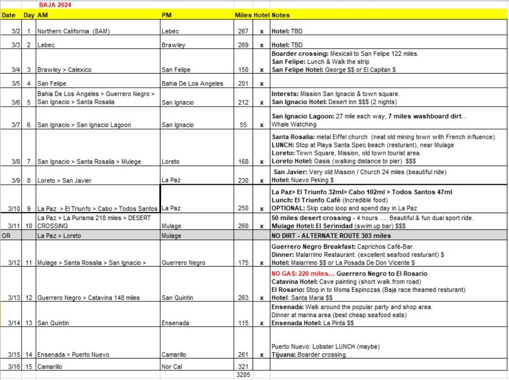
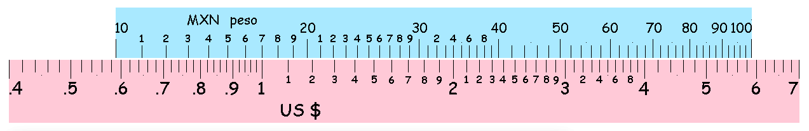
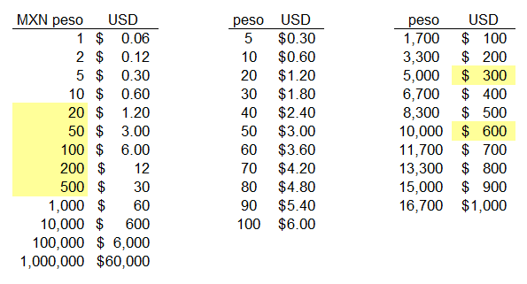
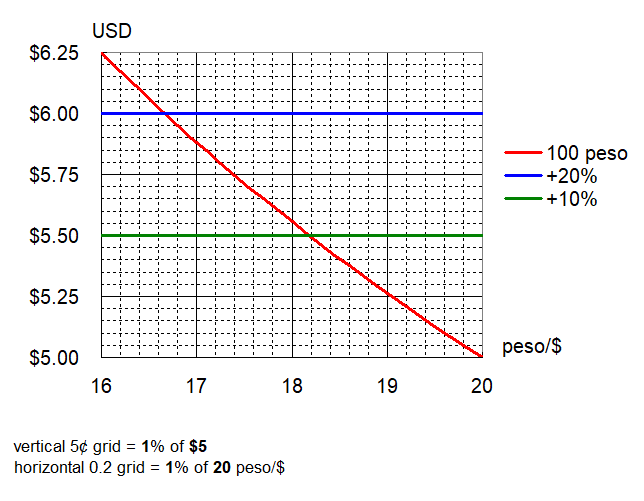
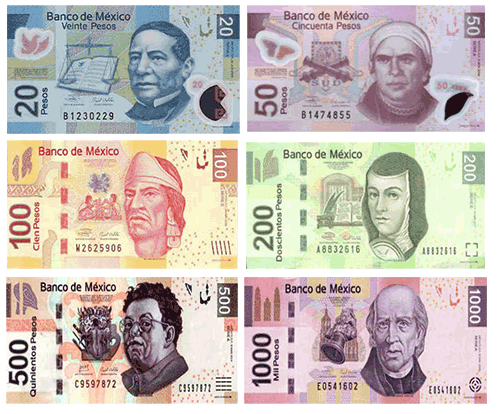
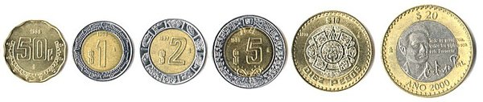
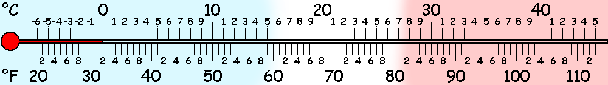
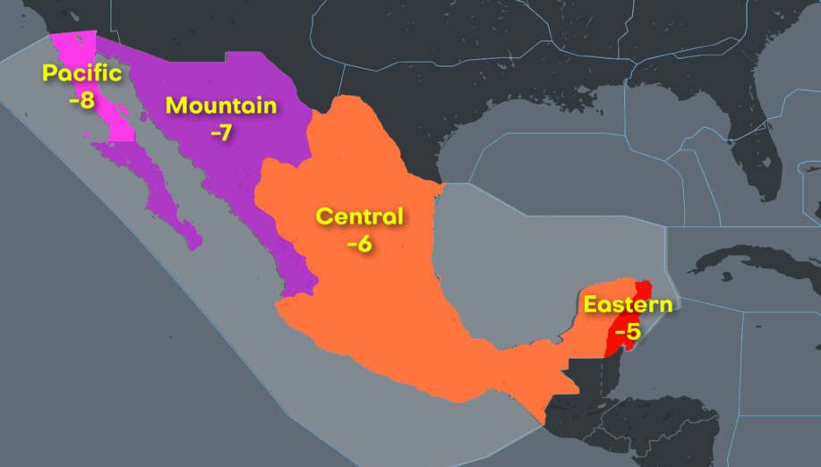

Motorcycle trip down the Baja California peninsula. Sightseeing, whale watching,
beach wandering, and fish taco eating.
Predominantly riding paved roads on street tires.

*Suitable for larger adventure bikes, Expect up to 40 miles of well groomed
dirt roads. Tires should be good for 3600 miles.*

<!--more-->

## Summary

* **WHEN:** Meet 9:45 AM **(KSU 10:00AM sharp!)**
* **WHERE:** [Starbucks](https://maps.app.goo.gl/GDEZLTncZGp8LNnJA),
  :coffee: 1730 Airline Highway, Hollister, CA 95023
* [Signal](https://signal.group/#CjQKIBx4zFOT5mC6fkV5rqoU4SRHC9PJJqvblp9cvcae1JKeEhBQnqUlOZiEhhG7BiIUE2Wk)
* [Notes](Matt_2.jpg) from Jun 8 discussion.
* [GPX]() file

## Attendees



## Itinerary

### 15 Day Itinerary



| Day | Date | Activity | GPX | Miles | KMs | Maps | Image | Lodging
| --- | ---- | -------- | --- | ----- | --- | ---- | ----- | -------
| 0 | Sat Mar 2nd | Hollister, Coalinga, Maricopa, Cerro, Noroeste, Lebec<br><br>CA-25, CA-198, CA-33, CA-166, Mil Portrero | [us0](us0.gpx) | 309 | 498 | [Google](https://www.google.com/maps/dir/37.3959,-122.1019/37.2893,-121.8943/36.8380,-121.3906/36.1370,-120.3626/35.0584,-119.4001/34.8188,-118.8824), [OnTheGo](https://onthegomap.com/s/jb9pjlor), [interactive](https://www.goattrails.info/baja/maps/us0.html) |  | [Holiday Inn](https://www.ihg.com/holidayinnexpress/hotels/us/en/lebec/bkrfr/hoteldetail), [Motel 6](https://www.motel6.com/en/home/motels.ca.lebec.4640.html) $75 ~ $160 [Lebec](https://www.google.com/maps/place/34.8188,-118.8824)
| 1 | Sun Mar 3rd | Lake Hughes, Wrightwood, Hemet, Warner Springs, Poway<br><br>N2, N6, N4, Big Pines, CA-66, CA-2, I-215, I-10, San Timoteo Canyon, CA-79, CA-78<br><br><mark>caveat: Big Pines at 7,000ft and Wildwood at 6,000ft may be snowed in. Detour via Bob's Gap to CA-138. | [us1](us1.gpx) | 254 | 408 | [Google](https://www.google.com/maps/dir/34.8188,-118.8824/34.3609,-117.6329/33.7480,-117.0067/33.2832,-116.6344/32.9522,-117.0611), [OnTheGo](https://onthegomap.com/s/lcgjdtg1), [interactive](https://www.goattrails.info/baja/maps/us1.html) |  | [Ramada](https://www.wyndhamhotels.com/ramada/poway-california/ramada-poway-san-diego-north/overview), [Best Western](https://www.bestwestern.com/en_US/book/hotel-rooms.05639.html) $140 [Poway](https://www.google.com/maps/place/32.9522,-117.0611)
| 2 | Mon Mar 4th | Tecate border crossing :mexico:, Sierra Juarez, Mexicali, San Felipe<br><br>CA-94, MEX-2D, Mex-5 | [bj2](bj2.gpx) | 254 | 409 | [Google](https://www.google.com/maps/dir/34.8188,-118.8824/34.3609,-117.6329/33.7480,-117.0067/33.2832,-116.6344/32.9522,-117.0611) [OnTheGo](https://onthegomap.com/s/lcgjdtg1) [interactive](https://www.goattrails.info/baja/maps/us1.html) |  | [El Capitán](https://www.hotelcapitansanfelipe.com/), [Hotel George](https://www.georges-hotel.com/) ~$120 [San Felipe](https://www.google.com/maps/place/31.0197,-114.8350)
| 3 | Tue Mar 5th | Mar de Cortés, Sierra de Calamajué, Sierra Salorio, Bahía de los Ángeles<br><br>MEX-5, MEX-1, MEX-12 | [bj3](bj3.gpx) | 202 | 325 | [Google](https://www.google.com/maps/dir/31.0252,-114.8422/29.7924,-114.4138/29.3757,-114.3745/29.0462,-114.1529/28.9605,-113.5639/28.9498,-113.5599) [OnTheGo](https://onthegomap.com/s/q4bttcsh) [interactive](https://www.goattrails.info/baja/maps/bj3.html) |  | TBD hotel, [Motel Princess](https://www.motelprincessbdla.com/) ~$90 (1500 pesos) [Bahía de los Ángeles](https://www.google.com/maps/place/28.9498,-113.5599)
| 4 | Wed Mar 6th | Sierra de Calmalli, Guerrero Negro, Desierto el Vizcaíno, Sierra San Francisco, Misión San Ignacio<br><br>MEX-12, MEX-1 | [bj4](bj4.gpx) | 171 | 275 | [Google](https://www.google.com/maps/dir/27.3021,-112.8954/27.3414,-112.2664/27.3372,-112.2682/26.8906,-111.9841/26.7651,-111.8878/26.0069,-111.3499/26.0069,-111.3393) [OnTheGo](https://onthegomap.com/s/2gddekar) [interactive](https://www.goattrails.info/baja/maps/bj6.html) |  | [Hotel Oasis](https://www.hoteloasis.com/) $210 (3,500 pesos) [Loreto](https://www.google.com/maps/place/26.0069,-111.3393)
| 14 | Sat Mar 16th | Santa Ynez Mountains, Nipomo Valley, Rossi's driveway, Airline highway, home<br><br>US-101, CA-154, Foxen Canyon, Tepusquet, CA-166, CA-227, CA-229, Cross Canyon, Peach Tree, Indian Valley, CA-25, US-101 | [us14](us14.gpx) | 370 | 596 | [Google](https://www.google.com/maps/dir/34.2221,-119.0698/35.0361,-120.4865/35.7476,-120.6994/36.8380,-121.3906/37.3959,-122.1019) [OnTheGo](https://onthegomap.com/s/2mebn9u4) [Interactive](https://www.goattrails.info/baja/maps/us14.html) |  | Home

### 6 Day Itinerary



| Day | Date | Activity | GPX | Miles | KMs | Maps | Image | Lodging
| --- | ---- | -------- | --- | ----- | --- | ---- | ----- | -------
| 0 | Sat Mar 2nd | Hollister, Coalinga, Maricopa, Cerro, Noroeste, Lebec<br><br>CA-25, CA-198, CA-33, CA-166, Mil Portrero | [us0](us0.gpx) | 309 | 498 | [Google](https://www.google.com/maps/dir/37.3959,-122.1019/37.2893,-121.8943/36.8380,-121.3906/36.1370,-120.3626/35.0584,-119.4001/34.8188,-118.8824), [OnTheGo](https://onthegomap.com/s/jb9pjlor), [interactive](https://www.goattrails.info/baja/maps/us0.html) |  | [Holiday Inn](https://www.ihg.com/holidayinnexpress/hotels/us/en/lebec/bkrfr/hoteldetail), [Motel 6](https://www.motel6.com/en/home/motels.ca.lebec.4640.html) $75 ~ $160 [Lebec](https://www.google.com/maps/place/34.8188,-118.8824)
| 1 | Sun Mar 3rd | Lake Hughes, Wrightwood, Hemet, Warner Springs, Poway<br><br>N2, N6, N4, Big Pines, CA-66, CA-2, I-215, I-10, San Timoteo Canyon, CA-79, CA-78<br><br><mark>caveat: Big Pines at 7,000ft and Wildwood at 6,000ft may be snowed in. Detour via Bob's Gap to CA-138. | [us1](us1.gpx) | 254 | 408 | [Google](https://www.google.com/maps/dir/34.8188,-118.8824/34.3609,-117.6329/33.7480,-117.0067/33.2832,-116.6344/32.9522,-117.0611), [OnTheGo](https://onthegomap.com/s/lcgjdtg1), [interactive](https://www.goattrails.info/baja/maps/us1.html) |  | [Ramada](https://www.wyndhamhotels.com/ramada/poway-california/ramada-poway-san-diego-north/overview), [Best Western](https://www.bestwestern.com/en_US/book/hotel-rooms.05639.html) $140 [Poway](https://www.google.com/maps/place/32.9522,-117.0611)
| 2 | Mon Mar 4th | Tecate border crossing :mexico:, Sierra Juarez, Mexicali, San Felipe<br><br>CA-94, MEX-2D, Mex-5 | [bj2](bj2.gpx) | 254 | 409 | [Google](https://www.google.com/maps/dir/34.8188,-118.8824/34.3609,-117.6329/33.7480,-117.0067/33.2832,-116.6344/32.9522,-117.0611) [OnTheGo](https://onthegomap.com/s/lcgjdtg1) [interactive](https://www.goattrails.info/baja/maps/us1.html) |  | [El Capitán](https://www.hotelcapitansanfelipe.com/), [Hotel George](https://www.georges-hotel.com/) ~$120 [San Felipe](https://www.google.com/maps/place/31.0197,-114.8350)
| 5 | Thu Mar 7th | Santa Ynez Mountains, Nipomo Valley, Rossi's driveway, Airline highway, home<br><br>US-101, CA-154, Foxen Canyon, Tepusquet, CA-166, CA-227, CA-229, Cross Canyon, Peach Tree, Indian Valley, CA-25, US-101 | [us14](us14.gpx) | 370 | 596 | [Google](https://www.google.com/maps/dir/34.2221,-119.0698/35.0361,-120.4865/35.7476,-120.6994/36.8380,-121.3906/37.3959,-122.1019) [OnTheGo](https://onthegomap.com/s/2mebn9u4) [Interactive](https://www.goattrails.info/baja/maps/us14.html) |  | Home

## Route





```
sunrise ☼ 6:30 ~ 18:30 ☽ GMT-7 or GMT-8

  LAT      LONG   WP  NAME                 MILE     ETA
¯¯¯¯¯¯¯ ¯¯¯¯¯¯¯¯¯ ¯¯¯ ¯¯¯¯¯¯¯¯¯¯¯¯¯¯¯¯¯¯ ¯¯¯¯¯¯¯ ¯ ¯¯¯¯¯ ¯
US0 home → Lebec
¯¯¯¯¯¯¯ ¯¯¯¯¯¯¯¯¯ ¯¯¯ ¯¯¯¯¯¯¯¯¯¯¯¯¯¯¯¯¯¯ ¯¯¯¯¯¯¯ ¯ ¯¯¯¯¯ ¯
37.3959,-122.1019 U00 home                     0    8:00
37.2893,-121.8943 U01 Matt                  / 17    8:30
36.8380,-121.3906 U02 Hollister           63/ 63 G  9:45 ksu 10
36.1370,-120.3626 U03 Coalinga            95/158 G 12:30 L
35.0584,-119.4001 U04 Maricopa           102/260 G 16:45
34.8188,-118.8824 U05 Lebec               49/309 M 18:30

¯¯¯¯¯¯¯ ¯¯¯¯¯¯¯¯¯ ¯¯¯ ¯¯¯¯¯¯¯¯¯¯¯¯¯¯¯¯¯¯ ¯¯¯¯¯¯¯ ¯ ¯¯¯¯¯ ¯
US1 Lebec → Poway
¯¯¯¯¯¯¯ ¯¯¯¯¯¯¯¯¯ ¯¯¯ ¯¯¯¯¯¯¯¯¯¯¯¯¯¯¯¯¯¯ ¯¯¯¯¯¯¯ ¯ ¯¯¯¯¯ ¯
34.8188,-118.8824 U05 Lebec                    0    8:00
34.3609,-117.6329 U11 Wrightwood gas      88/ 88 G 11:00 L
33.7480,-117.0067 U12 Hemet gas           72/160 G 14:30
33.2832,-116.6344 U13 Warner Springs gas    /208   16:00
32.9522,-117.0611 U14 Poway               94/254 M 17:45

¯¯¯¯¯¯¯ ¯¯¯¯¯¯¯¯¯ ¯¯¯ ¯¯¯¯¯¯¯¯¯¯¯¯¯¯¯¯¯¯ ¯¯¯¯¯¯¯ ¯ ¯¯¯¯¯ ¯
BJ2 Poway →  San Felipe
¯¯¯¯¯¯¯ ¯¯¯¯¯¯¯¯¯ ¯¯¯ ¯¯¯¯¯¯¯¯¯¯¯¯¯¯¯¯¯¯ ¯¯¯¯¯¯¯ ¯ ¯¯¯¯¯ ¯
32.9522,-117.0611 U14 Poway                 /  0    8:00
32.5763,-116.6275 B20 Tecati border         / 49    9:45
32.5627,-115.4201 B21 Mexicali gas       137/137 G 13:00 L
31.0252,-114.8422 B22 San Felipe gas     116/253 G 17:40
31.0197,-114.8350 B23 El Capitán hotel      /254 M 18:00
31.0183,-114.8357 B24 Hotel George          /254 M 18:00

¯¯¯¯¯¯¯ ¯¯¯¯¯¯¯¯¯ ¯¯¯ ¯¯¯¯¯¯¯¯¯¯¯¯¯¯¯¯¯¯ ¯¯¯¯¯¯¯ ¯ ¯¯¯¯¯ ¯
BJ3 San Felipe → Bahía de los Ángeles
¯¯¯¯¯¯¯ ¯¯¯¯¯¯¯¯¯ ¯¯¯ ¯¯¯¯¯¯¯¯¯¯¯¯¯¯¯¯¯¯ ¯¯¯¯¯¯¯ ¯ ¯¯¯¯¯ ¯
31.0252,-114.8422 B22 San Felipe gas        /  0    8:00
29.7924,-114.4138 B31 Pemex gas           98/ 98 G 11:15
29.3757,-114.3745 B32 restaurant            /131   12:30 L
29.0462,-114.1529 B33 roadside gas 1        /161   14:45
28.9605,-113.5639 B34 Bahía de LA gas    103/201 G 16:00
28.9498,-113.5599 B35 TBD hotel            1/202 M 16:15

¯¯¯¯¯¯¯ ¯¯¯¯¯¯¯¯¯ ¯¯¯ ¯¯¯¯¯¯¯¯¯¯¯¯¯¯¯¯¯¯ ¯¯¯¯¯¯¯ ¯ ¯¯¯¯¯ ¯
BJ4 Bahía de los Ángeles → San Ignacio
¯¯¯¯¯¯¯ ¯¯¯¯¯¯¯¯¯ ¯¯¯ ¯¯¯¯¯¯¯¯¯¯¯¯¯¯¯¯¯¯ ¯¯¯¯¯¯¯ ¯ ¯¯¯¯¯ ¯
28.9605,-113.5639 B34 Bahía de LA gas       /  0    8:00
28.2871,-113.9992 B41 Villa JM gas          / 99   11:15
27.9674,-114.0281 B42 Guerrero Negro gas 122/122 G 12:00 L
27.3021,-112.8954 B43 San Ignacio gas     89/211 G 16:15
27.2870,-112.9007 B44 Hotel Desert Inn     2/213 M 16:30
27.2837,-112.8984 B45 Misión San Ignacio   0/213   16:45

¯¯¯¯¯¯¯ ¯¯¯¯¯¯¯¯¯ ¯¯¯ ¯¯¯¯¯¯¯¯¯¯¯¯¯¯¯¯¯¯ ¯¯¯¯¯¯¯ ¯ ¯¯¯¯¯ ¯
BJ5 whale watching
¯¯¯¯¯¯¯ ¯¯¯¯¯¯¯¯¯ ¯¯¯ ¯¯¯¯¯¯¯¯¯¯¯¯¯¯¯¯¯¯ ¯¯¯¯¯¯¯ ¯ ¯¯¯¯¯ ¯
27.3021,-112.8954 B43 San Ignacio gas       /  0    7:00
26.9432,-113.0695 B51 end pavement          / 32    8:00
26.8296,-113.1679 B52 Laguna San Ignacio    / 42    8:30 5 hr 🐳 👀
27.3021,-112.8954 B43 San Ignacio gas     85/ 85 G 15:00

¯¯¯¯¯¯¯ ¯¯¯¯¯¯¯¯¯ ¯¯¯ ¯¯¯¯¯¯¯¯¯¯¯¯¯¯¯¯¯¯ ¯¯¯¯¯¯¯ ¯ ¯¯¯¯¯ ¯
BJ6 San Ignacio → Loreto
¯¯¯¯¯¯¯ ¯¯¯¯¯¯¯¯¯ ¯¯¯ ¯¯¯¯¯¯¯¯¯¯¯¯¯¯¯¯¯¯ ¯¯¯¯¯¯¯ ¯ ¯¯¯¯¯ ¯
27.3021,-112.8954 B43 San Ignacio gas       /  0    8:00
27.3414,-112.2664 B61 Santa Rosalía gas     / 45    9:30
27.3372,-112.2682 B62 Igles SantaBarbar     / 46    9:40
26.8906,-111.9841 B63 Mulegé gas          85/ 85 G 11:15
26.7651,-111.8878 B64 Playa Santispac       / 98   12:15 L
26.0069,-111.3499 B65 Loreto gas          84/169 G 15:30
26.0102,-111.3431 B66 Mission Loreto        /170   15:45
26.0069,-111.3393 B67 Hotel Oasis          1/171 M 16:30

¯¯¯¯¯¯¯ ¯¯¯¯¯¯¯¯¯ ¯¯¯ ¯¯¯¯¯¯¯¯¯¯¯¯¯¯¯¯¯¯ ¯¯¯¯¯¯¯ ¯ ¯¯¯¯¯ ¯
BJ7 Loreto → La Paz
¯¯¯¯¯¯¯ ¯¯¯¯¯¯¯¯¯ ¯¯¯ ¯¯¯¯¯¯¯¯¯¯¯¯¯¯¯¯¯¯ ¯¯¯¯¯¯¯ ¯ ¯¯¯¯¯ ¯
26.0069,-111.3393 B67 Hotel Oasis              0    8:00
25.8608,-111.5435 B71 Misión San Javier     / 24    9:00
25.8483,-111.3322 B72 Mirador Loreto        / 57   10:00
25.2513,-111.7741 B73 Cd Insurgentes gas 119/119 G 12:15 L
25.0424,-111.6781 B74 Constitución gas      /134   13:45
24.3939,-111.1096 B75 Las Pocitas gas     77/196 G 15:45
24.1510,-110.3266 B76 La Paz gas          72/268 G 18:15
24.1666,-110.3115 B77 Nuevo Pekin hotel    1/269 M 18:30

¯¯¯¯¯¯¯ ¯¯¯¯¯¯¯¯¯ ¯¯¯ ¯¯¯¯¯¯¯¯¯¯¯¯¯¯¯¯¯¯ ¯¯¯¯¯¯¯ ¯ ¯¯¯¯¯ ¯
BJ8 rest day 🌴 🛌
¯¯¯¯¯¯¯ ¯¯¯¯¯¯¯¯¯ ¯¯¯ ¯¯¯¯¯¯¯¯¯¯¯¯¯¯¯¯¯¯ ¯¯¯¯¯¯¯ ¯ ¯¯¯¯¯ ¯
24.1666,-110.3115 B77 Nuevo Pekin hotel     /  0    9:00
23.9735,-109.9599 B81 Juan D Cota           / 29   10:00
23.8024,-110.1084 B82 Cafe El Triunfo       / 47   10:30 L
24.1666,-110.3115 B77 Nuevo Pekin hotel   82/ 82   12:45

¯¯¯¯¯¯¯ ¯¯¯¯¯¯¯¯¯ ¯¯¯ ¯¯¯¯¯¯¯¯¯¯¯¯¯¯¯¯¯¯ ¯¯¯¯¯¯¯ ¯ ¯¯¯¯¯ ¯
BJ91 1st segment La Paz → Ciudad Insurgentes
¯¯¯¯¯¯¯ ¯¯¯¯¯¯¯¯¯ ¯¯¯ ¯¯¯¯¯¯¯¯¯¯¯¯¯¯¯¯¯¯ ¯¯¯¯¯¯¯ ¯ ¯¯¯¯¯ ¯
24.1666,-110.3115 B77 Nuevo Pekin hotel     /  0    8:00
24.3939,-111.1096 B75 Las Pocitas gas       / 70    9:45
25.0424,-111.6781 B74 Constitución gas      /132   11:30
25.2513,-111.7741 B73 Cd Insurgentes gas 147/147 G 12:30 L

BJ9pave 2nd segment → MEX-1
25.2513,-111.7741 B73 Cd Insurgentes gas    /  0   13:30
25.8483,-111.3322 B72 Mirador Loreto        / 62   15:00
26.0073,-111.3660 B91 Loreto gas 2          / 75   15:30
26.4353,-111.6383 B94 dirt 102              /112   16:30

BJ9dirt 2nd segment dirt option → MEX-1
25.2513,-111.7741 B73 Cd Insurgentes gas    /  0   13:30
26.1825,-112.0771 B92 roadside gas 2        / 72   15:15
26.2051,-112.0409 B93 dirt 101              / 75   15:20
26.4353,-111.6383 B94 dirt 102              /111   17:00

BJ93 3rd segment → Mulegé
26.4353,-111.6383 B94 dirt 102              /  0   16:30
26.8833,-111.9480 B95 Mulegé gas 2          / 44 G 18:00
26.8976,-111.9588 B96 Hotel Serenidad       / 46 M 18:15
                                       ∑ 158/305 G

¯¯¯¯¯¯¯ ¯¯¯¯¯¯¯¯¯ ¯¯¯ ¯¯¯¯¯¯¯¯¯¯¯¯¯¯¯¯¯¯ ¯¯¯¯¯¯¯ ¯ ¯¯¯¯¯ ¯
BJ10 Mulegé → Guerrero Negro
¯¯¯¯¯¯¯ ¯¯¯¯¯¯¯¯¯ ¯¯¯ ¯¯¯¯¯¯¯¯¯¯¯¯¯¯¯¯¯¯ ¯¯¯¯¯¯¯ ¯ ¯¯¯¯¯ ¯
26.8976,-111.9588 B96 Hotel Serenidad       /  0    8:00
27.3414,-112.2664 BA1 Santa Rosalia gas     / 41    9:30
27.3021,-112.8954 B43 San Ignacio gas     86/ 86 G 11:15
27.9674,-114.0281 B42 Guerrero Negro gas  89/175 G 13:30
27.9678,-114.0299 BA2 Malarrimo Hotel       /175 M

¯¯¯¯¯¯¯ ¯¯¯¯¯¯¯¯¯ ¯¯¯ ¯¯¯¯¯¯¯¯¯¯¯¯¯¯¯¯¯¯ ¯¯¯¯¯¯¯ ¯ ¯¯¯¯¯ ¯
BJ11 Guerrero Negro → San Quintín
¯¯¯¯¯¯¯ ¯¯¯¯¯¯¯¯¯ ¯¯¯ ¯¯¯¯¯¯¯¯¯¯¯¯¯¯¯¯¯¯ ¯¯¯¯¯¯¯ ¯ ¯¯¯¯¯ ¯
27.9678,-114.0299 BA2 Malarrimo Hotel       /  0    8:00
28.2871,-113.9992 B41 Villa JM gas        23/ 23 G  8:30
29.0469,-114.1528 B33 roadside gas 1        / 82   10:20
29.7304,-114.7208 BB1 roadside gas 2        /147   12:00
29.7510,-114.7447 BB2 Catavina cavepaint    /149   12:05
30.0586,-115.7252 BB3 Mamá Espinoza         /222   14:30 L
30.4229,-115.8806 BB4 San Quintín gas    228/251 G 16:30 ← fuel range concern
30.4016,-115.9117 BB5 Santa María hotel    3/254 M 16:45

¯¯¯¯¯¯¯ ¯¯¯¯¯¯¯¯¯ ¯¯¯ ¯¯¯¯¯¯¯¯¯¯¯¯¯¯¯¯¯¯ ¯¯¯¯¯¯¯ ¯ ¯¯¯¯¯ ¯
BJ12 San Quintín → Ensenada
¯¯¯¯¯¯¯ ¯¯¯¯¯¯¯¯¯ ¯¯¯ ¯¯¯¯¯¯¯¯¯¯¯¯¯¯¯¯¯¯ ¯¯¯¯¯¯¯ ¯ ¯¯¯¯¯ ¯
30.4016,-115.9117 BB5 Santa María hotel     /  0    8:00
30.7302,-115.9911 BC1 Vicente Guerr gas     / 26    8:45
31.3261,-116.2478 BC2 San Vicente gas       / 77   10:15
31.8588,-116.6168 BC3 La Pinta hotel     128/128 M 12:00

¯¯¯¯¯¯¯ ¯¯¯¯¯¯¯¯¯ ¯¯¯ ¯¯¯¯¯¯¯¯¯¯¯¯¯¯¯¯¯¯ ¯¯¯¯¯¯¯ ¯ ¯¯¯¯¯ ¯
BJ13 Ensenada → Camarillo
¯¯¯¯¯¯¯ ¯¯¯¯¯¯¯¯¯ ¯¯¯ ¯¯¯¯¯¯¯¯¯¯¯¯¯¯¯¯¯¯ ¯¯¯¯¯¯¯ ¯ ¯¯¯¯¯ ¯
31.8588,-116.6168 BC3 La Pinta hotel        /  0    8:00
32.2428,-116.9354 BD1 Puerto Nuevo          / 40    9:30 L
32.5426,-117.0290 BD2 San Ysidro border     / 75   11:30
32.5944,-117.0348 BD3 Chula Vista gas     79/ 79 G 12:00
33.4120,-117.6008 BD4 San Clemente gas      /147 G 13:45
34.1097,-118.7883 BD5 Rock Store            /250   17:30
34.2221,-119.0698 BD6 Camarillo             /278 M 18:30

¯¯¯¯¯¯¯ ¯¯¯¯¯¯¯¯¯ ¯¯¯ ¯¯¯¯¯¯¯¯¯¯¯¯¯¯¯¯¯¯ ¯¯¯¯¯¯¯ ¯ ¯¯¯¯¯ ¯
US14 Camarillo → home
¯¯¯¯¯¯¯ ¯¯¯¯¯¯¯¯¯ ¯¯¯ ¯¯¯¯¯¯¯¯¯¯¯¯¯¯¯¯¯¯ ¯¯¯¯¯¯¯ ¯ ¯¯¯¯¯ ¯
34.2221,-119.0698 BD6 Camarillo             /  0    8:00
35.0361,-120.4865 UE1 Nipomo gas         130/130 G 12:15 L
35.7476,-120.6994 UE2 San Miguel gas      74/204 G 15:15
36.8380,-121.3906 UE3 Hollister          104/308 G 18:00
37.3959,-122.1019 UE4 home                62/370   20:00

G=gas, M=motel, xxx/yyy → xxx=miles since gas, yyy=cumulative miles
```

* Printable copies of this
[itenerary](https://www.goattrails.info/baja/daily_itin.pdf) (PDF 4 pages)
* Printable copies of daily
[tank bag notes](https://www.goattrails.info/baja/tankbag_merged.pdf) (PDF 15 pages)

## Preparations

### Fueling


The longest stretch on this trip between refueling stops could be 230 miles.


There may be roadside fuel peddlers but fuel availability, quality, and price
can not be trusted. Carry two-gallon spare fuel canister and fill it up before
these longer stretches.

Stations are full service with attendant. *Tip 10 pesos (60¢) or not.*

| Labeled    | Fuel
| ---------- | ----
| Magna      | Unleaded gasoline, green pump
| Premium    | Higher octane, red pump
| Nova       | Leaded gas
| Diesel Sin | Diesel

### Currency

[$1 → 17 pesos](https://www.google.com/search?q=1+usd+mxn)
... currently about 1 peso ≈ 6¢



peso **÷20** → $ 🇺🇸 (approximately) ... more precisely,
peso ≈ 6¢ = $ .06 = 6 ·10-2 = 6 ·101·10-3
$ **×20** → peso 🇲🇽 (approximately) ... more precisely, -15% ... or -1:7





Common bank notes are 💲 20, 50, 100, 200, 500





#### Cash

Exchange $300 ~ $500 USD to Mexican pesos just before crossing the border.
Less if using mostly credit card to pay for motels, meals, and gas.
More if using cash.

[Budget](cost_estimate.gif) $2,000 ~ $3,000 for this trip. [XLS](distances.xls)

#### Taxes

Mexico has 16% Impuesto al Valor Agregado (IVA). Frequently the value-added tax
is rolled into an item's price, so you pay 80 pesos for an 80 peso burrito on
the menu.

Occasionally, some touristy places handle pricing the opposite way. They specify
**16% IVA no incluido** on their menu and you would pay 116 pesos for a 100 peso
item on those menus.

### Visas

Americans do not need a Mexican visa to travel to Baja.

We are supposed to obtain a tourist card, also known as an entry permit (Forma
Migratoria Múltiple or FMM). One can apply for it online and pay the $38 fee,
but riders have gotten by without any FMM on past Baja trips.

US passport should be valid at for least 6 months, expiring after mid-September 2024.

Information about Crossing into Mexico and Returning to the U.S.. More from US
State Department.

### Insurance

We are supposed to carry Mexican car insurance, but riders have gotten by
without any Mexican insurance either on past Baja trips.

Vehicle permits (temporary import permit or TIP) are *not* required in Baja.

### License & Registration

Carry valid vehicle registration.

Carry a valid California driver's license, and as an option also get an
[International Driving Permit](https://www.goattrails.info/baja/image/ich_idp_redacted.jpg).
[AAA](https://www.aaa.com/vacation/idpf.html) can provide for **$20**. Bring two
passport photos, or AAA can take the photos for another **$20**.

### Signage

[Road signs](https://en.wikipedia.org/wiki/Road_signs_in_Mexico) in Mexico.

### Packing

* Mount fresh new front and rear tires prior to this trip.
  They will need to endure over 3,600 miles.
  Most bikes will be 500 pound adventure bikes like BMW F850GSes.
* Saddle Bags
* Tail and/or Tank bag
* 2 gallons extra fuel (bladder or container)
* Basic tools to handle flat repairs or minor tip overs.

#### Moto Ride

• Sena, battery power pack, USB cable
• gloves: mesh, winter, rain
• rain jacket
• ear plugs
• DSLR
• insurance & registration
• US passport
• cash, credit card
• cell phone
• pen
• maps, magnifier
• reading glasses

#### Moto Repair

• tire patch kit, inflator, pressure gauge
• spare fuel containers, funnel
• Torx & Hex tools
• bungee cord, paracord, carabiner
• zip ties, duct tape, metal wire, electrical tape
• WD40, paper towel, latex glove, PVC stand

#### Clothing

• sunglasses, hat
• sweat pants, shorts
• sweat shirt
• quick-dry shirts, socks, underwear ×3
• swim trunk, goggle
• slippers

#### Chargers

• USB-C phone charger, Sena charger
• camera charger, spare batteries
• extension cord
• flashlight, batteries

#### Toiletries

• nail clipper, tweezer
• razor, Q-tips
• tooth brush, tooth paste, floss, toothpick
• medications
• ear plugs
• detergent, sink stopper, paracord
• dish soap

### Weather

Weather in
:us:
[Taft](https://www.google.com/search?q=weather%20Taft%20CA),
[Brawley](https://www.google.com/search?q=weather%20Brawley%20CA),
:mexico:
[San Felipe](https://www.google.com/search?q=weather%20San%20Felipe%20Baja),
[San Ignacio](https://www.google.com/search?q=weather%20San%20Ignacio%20Baja),
[La Paz](https://www.google.com/search?q=weather%20La%20Paz%20Baja),
[Guerrero Negro](https://www.google.com/search?q=weather%20Guerrero%20Negro%20Baja),
[Ensenada](https://www.google.com/search?q=weather%20Ensenada%20Baja),
:us:
[Camarillo](https://www.google.com/search?q=weather%20Camarillo%20CA),
[San Jose](https://www.google.com/search?q=weather%20San%20Jose%20CA).



### Time Zones

The northern part Baja California follows **GMT -8** while the southern
part, Baja California Sur follows **GMT -7**.
Both use standard time year round.
Only a few border cities synchronize with US daylight saving time shifts.



### Español

* [Google Translate](https://translate.google.com/?sl=es&tl=en)
* [Spanish Dictionary](http://www.spanishdict.com/translate/a)
* [Wiktionary](https://en.wiktionary.org/)

Identificación Automática de Vehículos (IAVE)
:  electronic transponder for toll payments

carril derecho exclusivo IAVE
:  right lane exclusively for IAVE card

solo pago en efectivo y tarjeta IAVE
:  only cash payment and IAVE card

prepare su cuota
:  prepare to pay toll

plaza de cobro, caseta de cobro
:  toll plaza, caseta de cobro

inicia tramo a cargo de SCT
:  begin section maintained by Secretaría de Infraestructura, Comunicaciones y Transportes

no frene con motor
:  no engine braking

autopista, carretera
:  motorway, highway

alto
:  halt, stop

ceda el paso
:  cede, handover, yield the way

estacionar
:  park, station

desviación
:  deviation, detour

prohibido retorno
:  no U-turn

cuidado con el tren
:  beware of the train

puesto militar de seguridad
:  military security post

queja o sugerencia
:  complaint or suggestion

botica, farmacia, apoteca
:  drugstore, pharmacy

botana, aperitivo, entrada, tapa
:  snack, appetizer

refacción
:  repair, spare part

lleno por favor
:  fill up please

doscientos pesos
:  fill up with 200 pesos ($12 USD)

¿Acceptas tarjetas?
:  Do you accept credit cards?

sanitario, inodoro, baño, retrete
:  restroom, toilet, lavatory

almeja
:  clam

ostión
:  oyster
