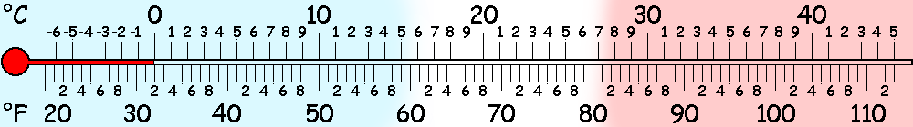
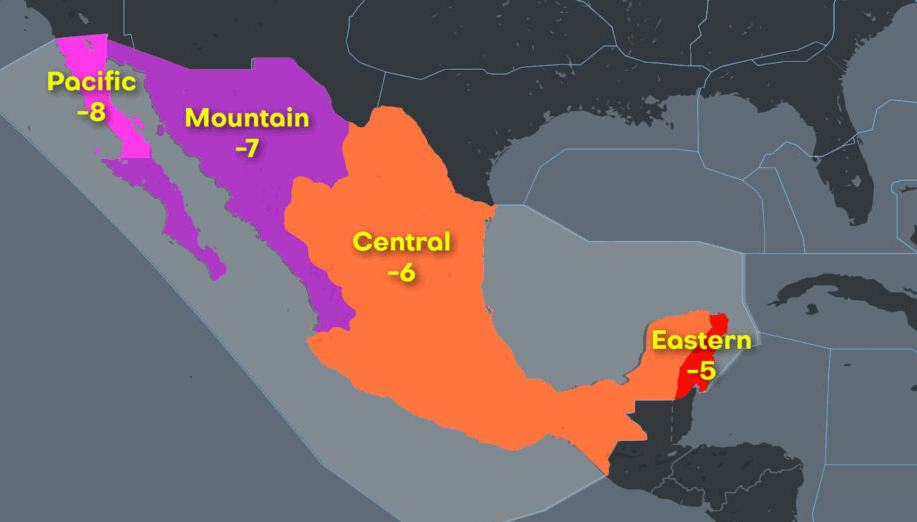

## Climate

Weather in
:us:
[Taft](https://www.google.com/search?q=weather%20Taft%20CA),
[Brawley](https://www.google.com/search?q=weather%20Brawley%20CA),
:mexico:
[San Felipe](https://www.google.com/search?q=weather%20San%20Felipe%20Baja),
[San Ignacio](https://www.google.com/search?q=weather%20San%20Ignacio%20Baja),
[La Paz](https://www.google.com/search?q=weather%20La%20Paz%20Baja),
[Guerrero Negro](https://www.google.com/search?q=weather%20Guerrero%20Negro%20Baja),
[Ensenada](https://www.google.com/search?q=weather%20Ensenada%20Baja),
:us:
[Camarillo](https://www.google.com/search?q=weather%20Camarillo%20CA),
[San Jose](https://www.google.com/search?q=weather%20San%20Jose%20CA).

## Time Zones

The northern part Baja California follows **GMT -8** while the southern
part, Baja California Sur follows **GMT -7**.
Both use standard time year round.
Only a few border cities synchronize with US daylight saving time shifts.

